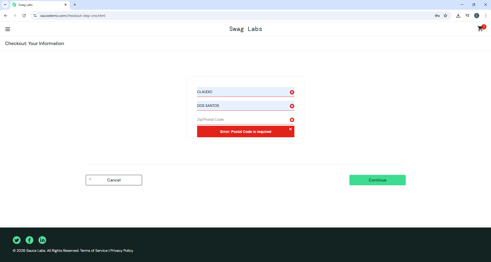

# Bug Report – BUG-001

## Título
Sistema destaca todos os campos como inválidos ao validar formulário de checkout com apenas um campo obrigatório não preenchido

## Tipo
Funcional

## Severidade
Alta

## Prioridade
Alta

## Descrição
Ao tentar prosseguir no checkout com qualquer campo obrigatório não preenchido, o sistema destaca incorretamente **todos os campos** como inválidos (ícone vermelho "X"), em vez de sinalizar apenas o campo com erro.

O comportamento afeta diretamente a experiência do usuário, dificultando a identificação do problema e podendo gerar abandono no fluxo de compra.

## Cenários afetados
- First Name não preenchido
- Last Name não preenchido
- Zip/Postal Code não preenchido

## Passos para reprodução (exemplo: First Name em branco)

1. Acessar https://www.saucedemo.com/
2. Realizar login com usuário `standard_user` e senha `secret_sauce`
3. Adicionar o produto "Sauce Labs Backpack" ao carrinho
4. Acessar o carrinho e clicar em "Checkout"
5. Preencher o campo "Last Name" com "Marcel"
6. Preencher o campo "Zip/Postal Code" com "01310-100"
7. Deixar o campo "First Name" em branco
8. Clicar no botão "Continue"

## Resultado esperado
Apenas o campo "First Name" deve ser destacado como inválido, com a mensagem:
`Error: First Name is required`

## Resultado atual
Todos os campos do formulário são destacados com ícone vermelho "X", mesmo os que estão corretamente preenchidos, gerando confusão sobre qual campo realmente precisa de correção.

## Impacto
- Usuário não consegue identificar com clareza qual campo está incorreto
- Aumenta a chance de abandono no fluxo de checkout
- Compromete a experiência de uso e a confiabilidade percebida da aplicação

## Evidência

## Ambiente
- **Browser:** Chrome 134.0
- **Sistema Operacional:** Windows 11
- **URL:** https://www.saucedemo.com/
- **Data:** 13/04/2026
